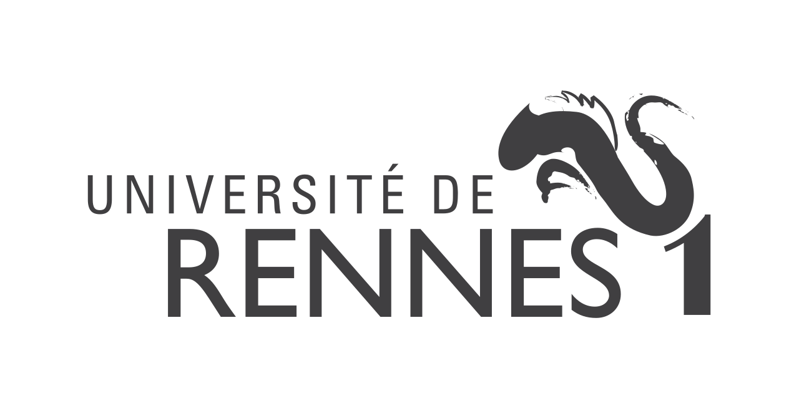

<html><head><meta content="text/html; charset=UTF-8" http-equiv="content-type"></head><body class="c72">

M1 Informatique - TP IA &nbsp; &nbsp; &nbsp; &nbsp; &nbsp; &nbsp; &nbsp; &nbsp; &nbsp; &nbsp; &nbsp; &nbsp; &nbsp; &nbsp; &nbsp; &nbsp; &nbsp; &nbsp; &nbsp; &nbsp;&nbsp;&nbsp;&nbsp;&nbsp;&nbsp;&nbsp;&nbsp;&nbsp;&nbsp;&nbsp;&nbsp;&nbsp;&nbsp;&nbsp;&nbsp;&nbsp;&nbsp;&nbsp;&nbsp;&nbsp;&nbsp;&nbsp;&nbsp;&nbsp; &nbsp; &nbsp; &nbsp; &nbsp; &nbsp; &nbsp; &nbsp; &nbsp; &nbsp; &nbsp; &nbsp;&nbsp;&nbsp;&nbsp;&nbsp;&nbsp;&nbsp;&nbsp;&nbsp; &nbsp;&nbsp;&nbsp;&nbsp;&nbsp;&nbsp;&nbsp;&nbsp;&nbsp; &nbsp; &nbsp; &nbsp; &nbsp; &nbsp; &nbsp; &nbsp;2020-2021

&nbsp;AKOTO Yao Arnaud P

Compte rendu du &nbsp;TP1 : Dames Anglaises avec MCTS

Objectif du TP

L&rsquo;objectif de ce TP &eacute;tait d&rsquo;impl&eacute;menter une intelligence artificielle &agrave; l&rsquo;aide de l&rsquo;algorithme de Monte-Carlo (MCTS) dans un jeu dont nous avons cod&eacute; les r&egrave;gles (Dames Anglaises) pour en suite analyser les performances avec diff&eacute;rents temps de calculer. 

Processus

Pour r&eacute;aliser notre t&acirc;che nous avons eu deux grandes &eacute;tapes qui sont :
<ul class="c6 lst-kix_njnd71z84k03-0 start"><li class="c11 c17 c39 li-bullet-0">L&rsquo;impl&eacute;mentation </li></ul><ul class="c6 lst-kix_njnd71z84k03-1 start"><li class="c11 c23 c39 li-bullet-0">Impl&eacute;mentation des r&egrave;gles du jeu</li><li class="c11 c23 c39 li-bullet-0">Impl&eacute;mentation du MCTS</li></ul><ul class="c6 lst-kix_njnd71z84k03-0"><li class="c11 c17 c39 li-bullet-0">L&rsquo;analyse des r&eacute;sultats</li></ul>

<ol class="c6 lst-kix_hfiucoeyw4da-0 start" start="1"><li class="c11 c31 li-bullet-0">Impl&eacute;mentations&nbsp;</li></ol><ol class="c6 lst-kix_hfiucoeyw4da-1 start" start="1"><li class="c11 c17 c39 li-bullet-0">&nbsp;Impl&eacute;mentation des r&egrave;gles du je</li></ol>

Pour commencer, il &eacute;tait important avant un tour de connaitre le statut des diff&eacute;rents cases de notre jeu de dame (vide, pion adverse, notre pion). &Agrave; l&rsquo;aide des fonctions :
<table class="c85 c93"><tbody><tr class="c14"><td class="c30" colspan="1" rowspan="1">
boolean&nbsp;isEmpty(int&nbsp;square) boolean&nbsp;isAdversary(int&nbsp;square) boolean&nbsp;isMine(int&nbsp;square) ArrayList&lt;Integer&gt; myPawns()
</td></tr></tbody></table>
Pour isEmpty, on a juste utiliser la fonction portant le m&ecirc;me non dans la classe CheckerBoard retournant la valeur souhait&eacute;e.

isAdversary et isMine&nbsp;sont impl&eacute;ment&eacute; quasiment de la m&ecirc;me mani&egrave;re: Si la valeur du joueur courant est ONE&nbsp;et &nbsp;la fonction isBlack&nbsp;du CheckerBoard&nbsp; ou si la valeur du joueur courant est TWO&nbsp;et &nbsp;la fonction isWhite&nbsp;on a alors une case contenant un adversaire. On fait l&rsquo;inverse pour celle contenant notre pion. &nbsp; 

Concernant myPawns,&nbsp;on retourne la liste contenant les pions noirs ou celle contenant les pions blancs en fonction de la valeur de notre joueur.

Ensuite, il fallait impl&eacute;menter les mouvements possibles du joueur courent (l&rsquo;&eacute;tape la plus difficile de cette premi&egrave;re partie).

Pour ce faire, on a d&ucirc; passer par six(6) fonctions auxiliaires dont une pas tr&egrave;s utile mais laiss&eacute;e pour la compr&eacute;hension du code:
<table class="c62"><tbody><tr class="c14"><td class="c57" colspan="1" rowspan="1">
ArrayList&lt;Integer&gt; calculMov&nbsp;(Integer from, boolean&nbsp;dame, boolean&nbsp;blanc,CheckerBoard board1)

 List&lt;Move&gt; deplacementPossible() List&lt;Move&gt; moveSansCapture()

 List&lt;Move&gt; movAvecCaptureForEach(int&nbsp;origin,int&nbsp;from, boolean&nbsp;blanc , boolean&nbsp;dame,CheckerBoard board1 ,DraughtsMove drMove , ArrayList&lt;Integer&gt; prise)

 List&lt;Move&gt; movAvecCaptureForAll() List&lt;Move&gt; moveAvecCapture() List&lt;Move&gt; possibleMoves()
</td></tr></tbody></table>
calculMov&nbsp;prend en param&egrave;tre : un pion, son type, sa couleur&nbsp;et un CheckerBoard.&nbsp;On commence par v&eacute;rifier si le pion est positionn&eacute; sur une extr&eacute;mit&eacute; du plateau puis en fonction de son type et de sa couleur, calcule les destinations que pourrait atteindre le pion s&rsquo;il y avait aucun obstacle pour l&rsquo;y en emp&ecirc;cher. &nbsp; &nbsp;

deplacementPossible&nbsp;utilise calculMov&nbsp; et myPawns&nbsp; et calcule pour chaque pion les d&eacute;placements possibles toujours sans contrainte comme si chaque pion &eacute;tait seul sur le damier puis forme des objets Move&nbsp;de sous la forme (from-t1xt2xt3x.... tn)&nbsp;o&ugrave; from repr&eacute;sente la position de d&eacute;part et t, la position d&rsquo;arriv&eacute;e.

Exemple :
<table class="c80"><tbody><tr class="c14"><td class="c83" colspan="1" rowspan="1">
&nbsp;------------- &nbsp; &nbsp; -------------  | &nbsp; 1&nbsp; &nbsp;2&nbsp; &nbsp;3&nbsp;| &nbsp; | &nbsp; x &nbsp; x &nbsp; x | | 4&nbsp; &nbsp;5&nbsp; &nbsp;6&nbsp; &nbsp;| &nbsp; | x &nbsp; x &nbsp; x &nbsp; | | &nbsp; 7&nbsp; &nbsp;8&nbsp; &nbsp;9&nbsp;| &nbsp; | &nbsp; . &nbsp; . &nbsp; . | |10&nbsp; 11&nbsp; 12&nbsp; &nbsp;| &nbsp; | . &nbsp; . &nbsp; . &nbsp; | | &nbsp;13&nbsp; 14&nbsp; 15&nbsp;| &nbsp; | &nbsp; o &nbsp; o &nbsp; o | |16&nbsp; 17&nbsp; 18&nbsp; &nbsp;| &nbsp; | o &nbsp; o &nbsp; o &nbsp; |  ------------- &nbsp; &nbsp; ------------- 

calculMov (14, !estDame, esBblanc, board) retrurne (11,12)

calculMov (16, !estDame, estBlanc, board) retourne (13) 

calculMov (13, estDame, esBblanc, board) retourne (10,11,16,17)

//on consid&egrave;re ici que chaque pion est seul sur le damier

deplacementPossible() retourne donc dans notre cas: 

&nbsp;13-10x11

&nbsp;14-11x12

&nbsp;15-12

&nbsp;16-13

&nbsp;17-13x14

&nbsp;18-14x15

</td></tr></tbody></table>

moveSansCapture&nbsp;r&eacute;cup&egrave;re la liste retourn&eacute;e par deplacementPossible,&nbsp;pour chaque sous-liste, isole le premier &eacute;l&eacute;ment qui est la case de d&eacute;part puis pour chaque destination vide, forme un doublet (from-to)&nbsp;et l&rsquo;ajoute &agrave; laliste des mouvements sans captures.

on a donc une double it&eacute;ration.

Pour un pion donn&eacute;, on calcule toutes ses prises possible avec movAvecCaptureForEach.

Ici aussi on utilise calculMov&nbsp; et pour chaque destination du pion de d&eacute;part, on v&eacute;rifie si c&rsquo;est un adversaire puis si elle n&rsquo;est pas d&eacute;j&agrave; dans la liste des pions d&eacute;j&agrave; captur&eacute;s. Ensuite si la destination n&rsquo;est pas une extr&eacute;mit&eacute; de notre damier. Une les trois conditions pr&eacute;c&eacute;dentes r&eacute;unis, on peut envisager une prise pour notre pion.

Pour savoir s&rsquo;il y a prise, on doit d&eacute;tecter le sens du voisinage&nbsp;entre le pion&nbsp;et la destination&nbsp;et si la case suivante dans le m&ecirc;me sens de voisinage est vide&nbsp;on a effectivement une prise. &nbsp; &nbsp; &nbsp; &nbsp;

Pour les prises multiples, on appelle r&eacute;cursivement movAvecCaptureForEach. &nbsp; &nbsp;

On remarque la pr&eacute;sence de trois param&egrave;tres particuliers (drMove, prise et origin):
<ul class="c6 lst-kix_n0rpi5riu1ki-0 start"><li class="c11 c23 c39 li-bullet-0">drMove :&Agrave; chaque r&eacute;cursion, on m&eacute;morise la trace de d&eacute;placement pour l&rsquo;ajoute &agrave; la liste de d&eacute;placement avec captures du pion seulement quand on arrive &agrave; la destination finale.</li><li class="c11 c23 c39 li-bullet-0">prise :Pour s&rsquo;assurer de ne pas boucler infiniment sur une prise, il faut &agrave; chaque fois ajouter la prise &agrave; la liste de pions captur&eacute;s.</li><li class="c11 c23 c39 li-bullet-0">origin :&nbsp; Si lors d&rsquo;une rafle, les adversaires sons dispos&eacute;s de tel sorte que notre pion a la possibilit&eacute; de repasser par sa position d&rsquo;origine, il est &eacute;vident que v&eacute;rifier uniquement que la case est vide ne le perp&eacute;trait pas alors nous avons ajout&eacute; la condition suivante : (isEmpty(to) || to == origin)&nbsp;</li></ul>
Illustration de l&rsquo;importance d&rsquo;origin&nbsp;: 
<table class="c17 c85"><tbody><tr class="c14"><td class="c64" colspan="1" rowspan="1">
&nbsp;----------------- &nbsp; &nbsp; -----------------  | &nbsp; 1&nbsp; &nbsp;2&nbsp; &nbsp;3&nbsp; &nbsp;4&nbsp;| &nbsp; | &nbsp; . &nbsp; O &nbsp; . &nbsp; . | | 5&nbsp; &nbsp;6&nbsp; &nbsp;7&nbsp; &nbsp;8&nbsp; &nbsp;| &nbsp; | . &nbsp; . &nbsp; . &nbsp; x &nbsp; | | &nbsp; 9&nbsp; 10&nbsp; 11&nbsp; 12&nbsp;| &nbsp; | &nbsp; . &nbsp; x &nbsp; x &nbsp; . | |13&nbsp; 14&nbsp; 15&nbsp; 16&nbsp; &nbsp;| &nbsp; | . &nbsp; x &nbsp; . &nbsp; . &nbsp; | | &nbsp;17&nbsp; 18&nbsp; 19&nbsp; 20&nbsp;| &nbsp; | &nbsp; . &nbsp; x &nbsp; x &nbsp; . | |21&nbsp; 22&nbsp; 23&nbsp; 24&nbsp; &nbsp;| &nbsp; | . &nbsp; . &nbsp; . &nbsp; . &nbsp; | | &nbsp;25&nbsp; 26&nbsp; 27&nbsp; 28&nbsp;| &nbsp; | &nbsp; . &nbsp; . &nbsp; o &nbsp; . | |29&nbsp; 30&nbsp; 31&nbsp; 32&nbsp; &nbsp;| &nbsp; | X &nbsp; o &nbsp; o &nbsp; o &nbsp; |  ----------------- &nbsp; &nbsp; ----------------- 

&nbsp; ||

&nbsp; \/

&nbsp;----------------- &nbsp; &nbsp; -----------------  | &nbsp; 1&nbsp; &nbsp;2&nbsp; &nbsp;3&nbsp; &nbsp;4&nbsp;| &nbsp; | &nbsp; . &nbsp; . &nbsp; . &nbsp; . | | 5&nbsp; &nbsp;6&nbsp; &nbsp;7&nbsp; &nbsp;8&nbsp; &nbsp;| &nbsp; | . &nbsp; . &nbsp; O &nbsp; x &nbsp; | | &nbsp; 9&nbsp; 10&nbsp; 11&nbsp; 12&nbsp;| &nbsp; | &nbsp; . &nbsp; x &nbsp; x &nbsp; . | |13&nbsp; 14&nbsp; 15&nbsp; 16&nbsp; &nbsp;| &nbsp; | . &nbsp; x &nbsp; . &nbsp; . &nbsp; | | &nbsp;17&nbsp; 18&nbsp; 19&nbsp; 20&nbsp;| &nbsp; | &nbsp; . &nbsp; X &nbsp; x &nbsp; . | |21&nbsp; 22&nbsp; 23&nbsp; 24&nbsp; &nbsp;| &nbsp; | . &nbsp; . &nbsp; . &nbsp; . &nbsp; | | &nbsp;25&nbsp; 26&nbsp; 27&nbsp; 28&nbsp;| &nbsp; | &nbsp; . &nbsp; . &nbsp; o &nbsp; . | |29&nbsp; 30&nbsp; 31&nbsp; 32&nbsp; &nbsp;| &nbsp; | X &nbsp; o &nbsp; o &nbsp; o &nbsp; |  ----------------- &nbsp; &nbsp; ----------------- 

&nbsp; ||

&nbsp; \/

&nbsp;----------------- &nbsp; &nbsp; -----------------  | &nbsp; 1&nbsp; &nbsp;2&nbsp; &nbsp;3&nbsp; &nbsp;4&nbsp;| &nbsp; | &nbsp; . &nbsp; . &nbsp; . &nbsp; . | &nbsp; | 5&nbsp; &nbsp;6&nbsp; &nbsp;7&nbsp; &nbsp;8&nbsp; &nbsp;| &nbsp; | . &nbsp; . &nbsp; O &nbsp; x &nbsp; |  | &nbsp; 9&nbsp; 10&nbsp; 11&nbsp; 12&nbsp;| &nbsp; | &nbsp; . &nbsp; x &nbsp; x &nbsp; . | |13&nbsp; 14&nbsp; 15&nbsp; 16&nbsp; &nbsp;| &nbsp; | . &nbsp; . &nbsp; . &nbsp; . &nbsp; | | &nbsp;17&nbsp; 18&nbsp; 19&nbsp; 20&nbsp;| &nbsp; | &nbsp; x &nbsp; x &nbsp; x &nbsp; . | |21&nbsp; 22&nbsp; 23&nbsp; 24&nbsp; &nbsp;| &nbsp; | . &nbsp; . &nbsp; . &nbsp; . &nbsp; | | &nbsp;25&nbsp; 26&nbsp; 27&nbsp; 28&nbsp;| &nbsp; | &nbsp; . &nbsp; . &nbsp; o &nbsp; . | |29&nbsp; 30&nbsp; 31&nbsp; 32&nbsp; &nbsp;| &nbsp; | X &nbsp; o &nbsp; o &nbsp; o &nbsp; |  ----------------- &nbsp; &nbsp; -----------------  &nbsp;Ici possibleMove&nbsp;retourne :  avec origin :{7x16x23x14x7 ; 7x14x21 ; 7x16x23x14x21 ; 7x14x23x16x7} &nbsp;

sans origin&nbsp;:{7x16x23x14 ; 7x14x21 ; 7x16x23x14x21 ; 7x14x23x16} 
</td></tr></tbody></table>
Par la suite, avec movAvecCaptureForAll&nbsp;on r&eacute;cup&egrave;re juste liste des d&eacute;placements avec prise pour tous les pions en it&eacute;rant sur myPawns.&nbsp;

moveAvecCapture&nbsp;est la fonction un peu inutile car retourne simplement movAvecCaptureForAll&nbsp;mais pur une question compr&eacute;hension du code on l&rsquo;a laiss&eacute;e.

Pour finir avec la partie des d&eacute;placements, dans possibleMoves on retourne moveAvecCapture&nbsp;si elle n&rsquo;est pas vide sinon on retourne moveSansCapture&nbsp; 

Pour finir nous avons r&eacute;ussi &agrave; impl&eacute;menter les M&eacute;thodes plus facilement:
<table class="c82"><tbody><tr class="c14"><td class="c71" colspan="1" rowspan="1">
void&nbsp;play(Move aMove) PlayerId winner() 
</td></tr></tbody></table>

Avec play,&nbsp;on parcourt le mouvement en param&egrave;tre en d&eacute;pla&ccedil;ant le pion au fur et &agrave; mesure qu&rsquo;on avance. Si entre le couple d&eacute;part-arriv&eacute;e, il y a un pion, on le capture en le supprimant du damier.

Si on a un mouvement avec prise ou un mouvement d&rsquo;un pion simple, on r&eacute;initialise la variable nbKingMovesWithoutCapture&nbsp; sinon elle est incr&eacute;ment&eacute;e.

Si un pion arrive &agrave; l&rsquo;extr&eacute;mit&eacute; adverse et que ce n&rsquo;est pas une dame il est imm&eacute;diatement promu en dame&nbsp;et passe son tour.

&Agrave; la fin du tour, on incr&eacute;mente le nombre de tours &nbsp;et on donne la main &agrave; l&rsquo;adversaire.

winner&nbsp;retourne NONE&nbsp;si on a seulement des mouvements de dames durant 25 tours (nbKingMovesWithoutCapture ==25). Si nous n&rsquo;avons plus la possibilit&eacute; de bouger ou si on n&rsquo;a plus de pion sur le damier alors c&rsquo;est l&rsquo;adversaire qui a gagn&eacute;.

<ol class="c6 lst-kix_hfiucoeyw4da-1" start="2"><li class="c11 c17 c39 li-bullet-0">&nbsp;Impl&eacute;mentation du MCTS</li></ol>
Dans cette deuxi&egrave;me partie, il s&rsquo;agissait pour nous d&rsquo;impl&eacute;menter l&rsquo;algorithme de Monte-Carlo. Pour ce faire nous avions &agrave; notre disposition la structure suivante que nous avons modifi&eacute; pour l&rsquo;adapter &agrave; notre impl&eacute;mentation:

<table class="c69"><tbody><tr class="c14"><td class="c79" colspan="1" rowspan="1">
public&nbsp;class&nbsp;MonteCarloTreeSearch&nbsp;{ &nbsp;&nbsp;&nbsp;&nbsp;&nbsp;&nbsp;&nbsp;&nbsp;class&nbsp;EvalNode&nbsp;{  &nbsp;&nbsp;&nbsp;&nbsp;&nbsp;&nbsp;&nbsp;&nbsp; &nbsp; &nbsp; &nbsp; Move move_node ; //Ajout&eacute; mouvement associer au n&oelig;ud &nbsp;&nbsp;&nbsp;&nbsp;&nbsp;&nbsp;&nbsp;&nbsp;&nbsp;&nbsp;&nbsp;&nbsp;&nbsp;&nbsp;&nbsp;&nbsp;EvalNode parent;//Ajout&eacute; : un pointeur vers le p&egrave;re  &nbsp;&nbsp;&nbsp;&nbsp;&nbsp;&nbsp;&nbsp;&nbsp;&nbsp;&nbsp;&nbsp;&nbsp;&nbsp;&nbsp;&nbsp;&nbsp;double&nbsp;uct()  &nbsp;&nbsp;&nbsp;&nbsp;&nbsp;&nbsp;&nbsp;&nbsp;&nbsp;&nbsp;&nbsp;&nbsp;&nbsp;&nbsp;&nbsp;&nbsp;double&nbsp;score()  &nbsp;&nbsp;&nbsp;&nbsp;&nbsp;&nbsp;&nbsp;&nbsp;&nbsp;&nbsp;&nbsp;&nbsp;&nbsp;&nbsp;&nbsp;&nbsp;void&nbsp;updateStats(RolloutResults res) &nbsp;&nbsp;&nbsp;&nbsp;&nbsp;&nbsp;&nbsp;&nbsp;&nbsp;&nbsp;&nbsp;&nbsp;&nbsp;&nbsp;&nbsp;&nbsp;void&nbsp;genererFils() &nbsp;//Ajout&eacute; &nbsp;&nbsp;&nbsp;&nbsp;&nbsp;&nbsp;&nbsp;&nbsp;&nbsp;&nbsp;&nbsp;&nbsp;&nbsp;&nbsp;&nbsp;&nbsp;EvalNode meilleurFeuille() //Ajout&eacute;  &nbsp;&nbsp;&nbsp;&nbsp;&nbsp;&nbsp;&nbsp;&nbsp;&nbsp;&nbsp;&nbsp;&nbsp;&nbsp;&nbsp;&nbsp;&nbsp;EvalNode meilleurFils&nbsp;() &nbsp; //Ajout&eacute; &nbsp;&nbsp;&nbsp;&nbsp;&nbsp;&nbsp;&nbsp;&nbsp;} &nbsp;&nbsp;&nbsp;&nbsp;&nbsp;&nbsp;&nbsp;&nbsp; &nbsp;&nbsp;&nbsp;&nbsp;&nbsp;&nbsp;&nbsp;&nbsp;static&nbsp;class RolloutResults()  &nbsp; &nbsp; &nbsp; static&nbsp;PlayerId playRandomlyToEnd(Game game)   &nbsp; &nbsp; &nbsp; static&nbsp;RolloutResults rollOut(final&nbsp;Game game, int&nbsp;nbRuns) &nbsp;&nbsp;&nbsp;&nbsp;&nbsp;&nbsp;&nbsp;&nbsp;public&nbsp;void&nbsp;evaluateTreeWithTimeLimit(int&nbsp;timeLimitMillis) &nbsp;&nbsp;&nbsp;&nbsp;&nbsp;&nbsp;&nbsp;&nbsp;public&nbsp;boolean&nbsp;evaluateTreeOnce() &nbsp;&nbsp;&nbsp;&nbsp;&nbsp;&nbsp;&nbsp;&nbsp;public&nbsp;Move getBestMove()  &nbsp; &nbsp; &nbsp; public&nbsp;String stats() }
</td></tr></tbody></table>

La premi&egrave;re des choses qu&rsquo;on avait &nbsp;&agrave; faire &eacute;tait de nous assurer que notre algorithme parcourait toutes les possibilit&eacute;s dans un &eacute;tat donn&eacute; du jeu avant de passer &agrave; l&rsquo;exploration des niveaux suivants. Pour ce faire nous avons utilis&eacute; la formule &nbsp; &nbsp;que nous avons impl&eacute;ment&eacute; dans la m&eacute;thode uct.&nbsp;

Pour commencer, on g&eacute;n&egrave;re imm&eacute;diatement les fils du root avec la m&eacute;thode genererFils&nbsp;qui it&egrave;re sur les mouvements possibles de l&rsquo;&eacute;tat courent du jeu en associant &agrave; chaque mouvement, un n&oelig;ud dont le p&egrave;re est le n&oelig;ud appelant. D&#39;o&ugrave; l&rsquo;ajout des attributs Move et EvalNode.&nbsp;  C&rsquo;est seulement avec la fonction evaluateTreeOnce&nbsp;que nous impl&eacute;mentons concr&egrave;tement le comportement de notre MCTS.

Avant de parcourir notre arbre, on commence par s&eacute;lectionner le meilleur n&oelig;ud &nbsp;l&rsquo;aide de meilleurFeuille&nbsp;qui parcoure l&rsquo;arbre et retourne la feuille la plus prometteuse de l&rsquo;arbre &agrave; l&rsquo;aide notamment l&rsquo;utilisation de l&rsquo;uct&nbsp;de chaque fils.

Une fois la meilleure feuille de l&rsquo;arborescence s&eacute;lectionn&eacute;e, on g&eacute;n&egrave;re aussi ses fils et on l&rsquo;ex&eacute;cute al&eacute;atoirement avec RolloutResults&nbsp;durant une p&eacute;riode donn&eacute;e en param&egrave;tre d&rsquo;ex&eacute;cution et retourne &agrave; chaque fin de partie al&eacute;atoire, des r&eacute;sultats que nous remontons aux diff&eacute;rents n&oelig;uds parcouru. &nbsp; &nbsp; &nbsp;

La petite subtilit&eacute; qui &agrave; pendant un moment boulevers&eacute; nos r&eacute;sultats est la m&eacute;thode updateStats&nbsp;qui permet de remonter le nombre de d&eacute;faites du n&oelig;ud courent (et non le nombre de victoires).

On stop l&rsquo;it&eacute;ration si notre root n&rsquo;a qu&rsquo;un seul fils ou quand on a un fils pour qui on a une victoire imminente (&ccedil;a ne sert &agrave; rien de calculer). 

Apr&egrave;s les calcules, on r&eacute;cup&egrave;re le meilleur coup avec getBestMove&nbsp; qui appel la fonction meilleurFils&nbsp;retournant le n&oelig;ud o&ugrave; notre probabilit&eacute; de gagner est plus forte (plus grand score). &nbsp; &nbsp; 

&nbsp;
<ol class="c6 lst-kix_hfiucoeyw4da-0" start="2"><li class="c11 c31 li-bullet-0">Analyse des r&eacute;sultats</li></ol>
Apr&egrave;s impl&eacute;mentation de l&rsquo;algorithme, nous l&rsquo;avons test&eacute; sur les diff&eacute;rentes versions des jeux &agrave; notre disposition (Tic-tac-toe, Dames 8x8, Dames 10x10, Dames 6x6) avec les diff&eacute;rents temps de calcul.

Ce qui nous retourne les r&eacute;sultats suivants :

Tic-Tac-Toe

Ici peu importe leurs diff&eacute;rents temps de calcul, les IA ont tous la m&ecirc;me performance. Cela est d&ucirc; au fait que l&rsquo;espace jeux est relativement petit et donc ne n&eacute;cessite pas beaucoup d&#39;effort de calcul. &nbsp; 

IA vs IA 

100%&nbsp;des parties confrontant deux IA peu importe leurs diff&eacute;rents temps de calcul se soldent sur des matchs nul.

Humain vs IA

Ici les r&eacute;sultats divergent en fonction de l&rsquo;adversaire que l&rsquo;IA a en face d&rsquo;elle.

C&#39;est en gros cette partie qui nous a compliqu&eacute;e la t&acirc;che on pensait que c&#39;&eacute;tait une erreur de notre impl&eacute;mentation alors que non. C&rsquo;est juste que MCTS&nbsp;n&rsquo;est pas l&rsquo;algorithme le plus adapt&eacute; pour ce genre de jeux o&ugrave; le nombre de coups possible est assez r&eacute;duit. 

Dans notre cas, l&rsquo;algorithme cherche &agrave; maximiser ses chances de gagner sans forc&eacute;ment minimiser celles de perdre.

Illustrations : 
<table class="c77"><tbody><tr class="c86"><td class="c34" colspan="1" rowspan="1">
//IA avec &#39;o&#39; et Humain avec &#39;x&#39;  &nbsp; &nbsp; &nbsp; &nbsp; board &nbsp; &nbsp; &nbsp;board &nbsp; &nbsp; board &nbsp; &nbsp; board &nbsp; &nbsp; board &nbsp; &nbsp; board &nbsp; &nbsp; board 0 1 2 &nbsp; &nbsp;. . . &nbsp; &nbsp; &nbsp;. . x &nbsp; &nbsp; o . x &nbsp; &nbsp; o . x &nbsp; &nbsp; o . x &nbsp; &nbsp; o. x &nbsp; &nbsp; &nbsp;o . x 3 4 5 &nbsp; &nbsp;. o . &nbsp; &nbsp; &nbsp;. o . &nbsp; &nbsp; . o . &nbsp; &nbsp; . o . &nbsp; &nbsp; . o . &nbsp; &nbsp; . o . &nbsp; &nbsp; . o . 6 7 8 &nbsp; &nbsp;. . . &nbsp; &nbsp; &nbsp;. . . &nbsp; &nbsp; . . . &nbsp; &nbsp; . . x &nbsp; &nbsp; . . x &nbsp; &nbsp; . . x &nbsp; &nbsp; . . x
</td></tr></tbody></table>

&Agrave; ce niveau de la partie de notre exemple, on constate que le meilleur coup ici pour &eacute;viter la d&eacute;faite est &ldquo;5&rdquo;&nbsp;alors que notre algorithme privil&eacute;giera l&rsquo;option &ldquo;3&rdquo;&nbsp;qui lui garantirait une victoire imminante au coup suivant. L&rsquo;option &ldquo;5&rdquo; n&rsquo;est pas choix car m&ecirc;me si elle lui &eacute;vite la d&eacute;faite sur le coup on a aucune garantis de gagner la partie.

Pour r&eacute;soudre ce probl&egrave;me, nous avons ajout&eacute; une pseudo heuristique&nbsp;permettant de savoir si apr&egrave;s notre tour l&rsquo;adversaire aurait un d&eacute;placement qui ferait imm&eacute;diatement perdre :

<table class="c74"><tbody><tr class="c14"><td class="c87" colspan="1" rowspan="1">
boolean&nbsp;verfDefaiteImediate(EvalNode node){ &nbsp;&nbsp;&nbsp;&nbsp;&nbsp;&nbsp;&nbsp;&nbsp;&nbsp;&nbsp;&nbsp;&nbsp;&nbsp;&nbsp;&nbsp;&nbsp;&nbsp;&nbsp;&nbsp;&nbsp;&nbsp;&nbsp;&nbsp;&nbsp;EvalNode nodeDeVerificationDeDefaite = new&nbsp;EvalNode(node.game.clone()); &nbsp;&nbsp;&nbsp;&nbsp;&nbsp;&nbsp;&nbsp;&nbsp;&nbsp;&nbsp;&nbsp;&nbsp;&nbsp;&nbsp;&nbsp;&nbsp;&nbsp;&nbsp;&nbsp;&nbsp;&nbsp;&nbsp;&nbsp;&nbsp;nodeDeVerificationDeDefaite.genererFils(); &nbsp;&nbsp;&nbsp;&nbsp;&nbsp;&nbsp;&nbsp;&nbsp;&nbsp;&nbsp;&nbsp;&nbsp;&nbsp;&nbsp;&nbsp;&nbsp;&nbsp;&nbsp;&nbsp;&nbsp;&nbsp;&nbsp;&nbsp;&nbsp;for&nbsp;(EvalNode n : nodeDeVerificationDeDefaite.children){ &nbsp;&nbsp;&nbsp;&nbsp;&nbsp;&nbsp;&nbsp;&nbsp;&nbsp;&nbsp;&nbsp;&nbsp;&nbsp;&nbsp;&nbsp;&nbsp;&nbsp;&nbsp;&nbsp;&nbsp;&nbsp;&nbsp;&nbsp;&nbsp;&nbsp;&nbsp;&nbsp;&nbsp;&nbsp;&nbsp;&nbsp;&nbsp;if&nbsp;(n.game.winner() !=null) &nbsp;&nbsp;&nbsp;&nbsp;&nbsp;&nbsp;&nbsp;&nbsp;&nbsp;&nbsp;&nbsp;&nbsp;&nbsp;&nbsp;&nbsp;&nbsp;&nbsp;&nbsp;&nbsp;&nbsp;&nbsp;&nbsp;&nbsp;&nbsp;&nbsp;&nbsp;&nbsp;&nbsp;&nbsp;&nbsp;&nbsp;&nbsp;return&nbsp;true; &nbsp;&nbsp;&nbsp;&nbsp;&nbsp;&nbsp;&nbsp;&nbsp;&nbsp;&nbsp;&nbsp;&nbsp;&nbsp;&nbsp;&nbsp;&nbsp;&nbsp;&nbsp;&nbsp;&nbsp;&nbsp;&nbsp;&nbsp;&nbsp;} &nbsp;&nbsp;&nbsp;&nbsp;&nbsp;&nbsp;&nbsp;&nbsp;&nbsp;&nbsp;&nbsp;&nbsp;&nbsp;&nbsp;&nbsp;&nbsp;&nbsp;&nbsp;&nbsp;&nbsp;&nbsp;&nbsp;&nbsp;&nbsp;return&nbsp;false; &nbsp;&nbsp;&nbsp;&nbsp;&nbsp;&nbsp;&nbsp;&nbsp;&nbsp;&nbsp;&nbsp;&nbsp;&nbsp;&nbsp;&nbsp;&nbsp;}
</td></tr></tbody></table>

&nbsp; &nbsp;Dans la m&ecirc;me lanc&eacute;e, nous topons l&rsquo;it&eacute;ration s&rsquo;il y a qu&rsquo;un seul fils qui peut nous sortie de la situation de d&eacute;faite ( int&nbsp;seSauverAvec(EvalNode node) == 1).

Les modifications apport&eacute;es am&eacute;liorent largement les l&rsquo;efficacit&eacute; de notre IA. les parties entre IA sont plus &eacute;labor&eacute;es et celle entre IA et humain se soldent au mieux par un nul pour l&rsquo;humain. (sur la base de trois dizaines de parties)&nbsp;

Dames Anglaise

Avec le jeu &nbsp;de Dames, la version am&eacute;lior&eacute;e n&rsquo;apporte pas grand changement dans les r&eacute;sultats qu&rsquo;on avait d&eacute;j&agrave; dans la premi&egrave;re version de notre MCTS&nbsp;sauf souvent en fin de partie.

Dans cette partie, les r&eacute;sultats varient en fonction de l&#39;espace de jeu et du temps de calcul.

Apr&egrave;s les parties entre diff&eacute;rents temps de jeu et espace(r&eacute;sultats en annexe page 9), on constate g&eacute;n&eacute;ralement que les d&eacute;buts de parties ne sont pas tr&egrave;s d&eacute;terminants.

La diff&eacute;rence se fait vers environ le 10&#7497; tour&nbsp;o&ugrave; le joueur avec le plus de temps de calcul commence &agrave; prendre l&rsquo;avantage sur l&rsquo;autre. C&#39;est seulement vers la fin de la partie que le jeu devient un peu &eacute;quilibr&eacute; en termes de choix &nbsp;de d&eacute;placement. 

Petite illustration pour revenir sur l&rsquo;am&eacute;lioration de notre MCTS&nbsp;en fin de partie
<table class="c58"><tbody><tr class="c14"><td class="c66" colspan="1" rowspan="1">
&nbsp;----------------- &nbsp; &nbsp; -----------------  | &nbsp; 1&nbsp; &nbsp;2&nbsp; &nbsp;3&nbsp; &nbsp;4&nbsp;| &nbsp; | &nbsp; x &nbsp; O &nbsp; . &nbsp; . | | 5&nbsp; &nbsp;6&nbsp; &nbsp;7&nbsp; &nbsp;8&nbsp; &nbsp;| &nbsp; | o &nbsp; . &nbsp; . &nbsp; O &nbsp; | | &nbsp; 9&nbsp; 10&nbsp; 11&nbsp; 12&nbsp;| &nbsp; | &nbsp; . &nbsp; . &nbsp; . &nbsp; . | |13&nbsp; 14&nbsp; 15&nbsp; 16&nbsp; &nbsp;| &nbsp; | . &nbsp; x &nbsp; . &nbsp; . &nbsp; | | &nbsp;17&nbsp; 18&nbsp; 19&nbsp; 20&nbsp;| &nbsp; | &nbsp; . &nbsp; . &nbsp; . &nbsp; . | |21&nbsp; 22&nbsp; 23&nbsp; 24&nbsp; &nbsp;| &nbsp; | o &nbsp; . &nbsp; . &nbsp; . &nbsp; | | &nbsp;25&nbsp; 26&nbsp; 27&nbsp; 28&nbsp;| &nbsp; | &nbsp; . &nbsp; O &nbsp; o &nbsp; . | |29&nbsp; 30&nbsp; 31&nbsp; 32&nbsp; &nbsp;| &nbsp; | . &nbsp; . &nbsp; . &nbsp; . &nbsp; |  ----------------- &nbsp; &nbsp; ----------------- 
</td></tr></tbody></table>

&Agrave; ce stade de la partie, le joueur &ldquo;x&rdquo;&nbsp; &agrave; 100% de chance de perdre la partie et il a la possibilit&eacute; d&rsquo;aller en : 1-6&nbsp;; 14-17&nbsp;et 14-18.&nbsp;Dans la premi&egrave;re version, il aurait choisi un mouvement al&eacute;atoire entre ces trois qui ont la m&ecirc;me probabilit&eacute;. Mais avec la version am&eacute;lior&eacute;e, on privil&eacute;giera le mouvement avec lequel on aura droit &agrave; des tours suppl&eacute;mentaire m&ecirc;me si la d&eacute;faite est imminente.

En somme on peut dire qu&rsquo;en d&eacute;but de partie l&rsquo;impression d&rsquo;&eacute;quilibre entre deux IA avec des temps diff&eacute;rents n&rsquo;est qu&rsquo;une illusion car celle avec le plus de temps de calcul effectue logiquement plus de partie al&eacute;atoires donc &agrave; plusieurs coups d&rsquo;avances sur l&rsquo;autre. Constat qui se confirme en milieu de partie o&ugrave; le nombre de d&eacute;placements possible croit largement. Ce qui signifie que l&rsquo;arborescence est plus grande et les choix deviennent de plus en plus critiques.

Cependant, en fin de partie, o&ugrave; les coups possibles sont largement r&eacute;duits, le temps de calcul perd plus ou moins son importance comme au tic-tac-toe&nbsp;ce qui fait qu&rsquo;on a des parties tr&egrave;s longues. Et le r&eacute;sultat est d&eacute;termin&eacute; par l&rsquo;avance pris en milieu de partie.

Aussi, les temps les plus longs ne conc&egrave;dent aucunes victoires (dans nos tests) au temps les plus courts.

&nbsp;

&nbsp; &nbsp; 

&nbsp; 

&nbsp;

Annexe: Les r&eacute;sultats des parties de Dames Anglaise

<table class="c68"><tbody><tr class="c0"><td class="c21" colspan="1" rowspan="1">

</td><td class="c70" colspan="3" rowspan="1">
1s vs &nbsp;2s
</td><td class="c8" colspan="1" rowspan="1">

</td><td class="c65" colspan="3" rowspan="1">
1s vs 5s
</td><td class="c8" colspan="1" rowspan="1">

</td><td class="c65" colspan="3" rowspan="1">
1s vs 10s
</td></tr><tr class="c0"><td class="c21" colspan="1" rowspan="1">
8x8
</td><td class="c20" colspan="1" rowspan="1">
0
</td><td class="c20" colspan="1" rowspan="1">
2
</td><td class="c8" colspan="1" rowspan="1">
1
</td><td class="c8" colspan="1" rowspan="1">

</td><td class="c8" colspan="1" rowspan="1">
0
</td><td class="c8" colspan="1" rowspan="1">
0
</td><td class="c8" colspan="1" rowspan="1">
4
</td><td class="c8" colspan="1" rowspan="1">

</td><td class="c8" colspan="1" rowspan="1">
0
</td><td class="c8" colspan="1" rowspan="1">
0
</td><td class="c8" colspan="1" rowspan="1">
0
</td></tr><tr class="c0"><td class="c21" colspan="1" rowspan="1">
10x10
</td><td class="c20" colspan="1" rowspan="1">
0
</td><td class="c20" colspan="1" rowspan="1">
1
</td><td class="c8" colspan="1" rowspan="1">
0
</td><td class="c8" colspan="1" rowspan="1">

</td><td class="c8" colspan="1" rowspan="1">
0
</td><td class="c8" colspan="1" rowspan="1">
2
</td><td class="c8" colspan="1" rowspan="1">
0
</td><td class="c8" colspan="1" rowspan="1">

</td><td class="c8" colspan="1" rowspan="1">
0
</td><td class="c8" colspan="1" rowspan="1">
0
</td><td class="c8" colspan="1" rowspan="1">
0
</td></tr><tr class="c0"><td class="c21" colspan="1" rowspan="1">
6x6
</td><td class="c20" colspan="1" rowspan="1">
0
</td><td class="c20" colspan="1" rowspan="1">
1
</td><td class="c8" colspan="1" rowspan="1">
1
</td><td class="c8" colspan="1" rowspan="1">

</td><td class="c8" colspan="1" rowspan="1">
0
</td><td class="c8" colspan="1" rowspan="1">
2
</td><td class="c8" colspan="1" rowspan="1">
0
</td><td class="c8" colspan="1" rowspan="1">

</td><td class="c8" colspan="1" rowspan="1">
0
</td><td class="c8" colspan="1" rowspan="1">
0
</td><td class="c8" colspan="1" rowspan="1">
1
</td></tr></tbody></table>

<table class="c68"><tbody><tr class="c0"><td class="c21" colspan="1" rowspan="1">

</td><td class="c70" colspan="3" rowspan="1">
2s vs 5s
</td><td class="c8" colspan="1" rowspan="1">

</td><td class="c65" colspan="3" rowspan="1">
2s &nbsp;vs 10s
</td></tr><tr class="c0"><td class="c21" colspan="1" rowspan="1">
8x8
</td><td class="c20" colspan="1" rowspan="1">
0
</td><td class="c20" colspan="1" rowspan="1">
1
</td><td class="c8" colspan="1" rowspan="1">
0
</td><td class="c8" colspan="1" rowspan="1">

</td><td class="c8" colspan="1" rowspan="1">
0
</td><td class="c8" colspan="1" rowspan="1">
1
</td><td class="c8" colspan="1" rowspan="1">
1
</td></tr><tr class="c0"><td class="c21" colspan="1" rowspan="1">
10x10
</td><td class="c20" colspan="1" rowspan="1">
0
</td><td class="c20" colspan="1" rowspan="1">
1
</td><td class="c8" colspan="1" rowspan="1">
0
</td><td class="c8" colspan="1" rowspan="1">

</td><td class="c8" colspan="1" rowspan="1">
0
</td><td class="c8" colspan="1" rowspan="1">
1
</td><td class="c8" colspan="1" rowspan="1">
1
</td></tr><tr class="c0"><td class="c21" colspan="1" rowspan="1">
6x6
</td><td class="c20" colspan="1" rowspan="1">
0
</td><td class="c20" colspan="1" rowspan="1">
0
</td><td class="c8" colspan="1" rowspan="1">
1
</td><td class="c8" colspan="1" rowspan="1">

</td><td class="c8" colspan="1" rowspan="1">
0
</td><td class="c8" colspan="1" rowspan="1">
1
</td><td class="c8" colspan="1" rowspan="1">
0
</td></tr></tbody></table>

<table class="c68"><tbody><tr class="c0"><td class="c21" colspan="1" rowspan="1">

</td><td class="c63" colspan="3" rowspan="1">
5s vs 10s
</td></tr><tr class="c0"><td class="c21" colspan="1" rowspan="1">
8x8
</td><td class="c52" colspan="1" rowspan="1">
0
</td><td class="c48" colspan="1" rowspan="1">
1
</td><td class="c48" colspan="1" rowspan="1">
0
</td></tr><tr class="c0"><td class="c21" colspan="1" rowspan="1">
10x10
</td><td class="c52" colspan="1" rowspan="1">
0
</td><td class="c48" colspan="1" rowspan="1">
0
</td><td class="c48" colspan="1" rowspan="1">
1
</td></tr><tr class="c0"><td class="c21" colspan="1" rowspan="1">
6x6
</td><td class="c52" colspan="1" rowspan="1">
0
</td><td class="c48" colspan="1" rowspan="1">
1
</td><td class="c48" colspan="1" rowspan="1">
0
</td></tr></tbody></table>

</body></html>