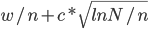

# M1 Informatique - TP IA  2020-2021

##  AKOTO Yao Arnaud P   

## Compte rendu du  TP1 : Dames Anglaises avec MCTS

### Objectif du TP

L’objectif de ce TP était d’implémenter une intelligence artificielle à l’aide de l’algorithme de Monte-Carlo (MCTS) dans un jeu dont nous avons codé les règles (Dames Anglaises) pour en suite analyser les performances avec différents temps de calculer.

### Processus

Pour réaliser notre tâche nous avons eu deux grandes étapes qui sont :

*   L’implémentation

*   Implémentation des règles du jeu
*   Implémentation du MCTS

*   L’analyse des résultats

#### 1.  Implémentations 

1.   Implémentation des règles du je

Pour commencer, il était important avant un tour de connaitre le statut des différents cases de notre jeu de dame (vide, pion adverse, notre pion). À l’aide des fonctions :

<table class="c85 c93">

<tbody>

<tr class="c14">

<td class="c30" colspan="1" rowspan="1">

boolean isEmpty(int square)  
boolean isAdversary(int square)  
boolean isMine(intsquare)  
ArrayList<Integer> myPawns()

</td>

</tr>

</tbody>

</table>

Pour isEmpty, on a juste utiliser la fonction portant le même non dans la classe CheckerBoard retournant la valeur souhaitée.

isAdversary et isMinesont implémenté quasiment de la même manière: Si la valeur du joueur courant est ONEet  la fonction isBlackdu CheckerBoardou si la valeur du joueur courant est TWOet  la fonction isWhite on a alors une case contenant un adversaire. On fait l’inverse pour celle contenant notre pion.  

Concernant myPawns, on retourne la liste contenant les pions noirs ou celle contenant les pions blancs en fonction de la valeur de notre joueur.

Ensuite, il fallait implémenter les mouvements possibles du joueur courent (l’étape la plus difficile de cette première partie).

Pour ce faire, on a dû passer par six(6) fonctions auxiliaires dont une pas très utile mais laissée pour la compréhension du code:

<table class="c62">

<tbody>

<tr class="c14">

<td class="c57" colspan="1" rowspan="1">

ArrayList<Integer> calculMov(Integer from, booleandame, boolean blanc,CheckerBoard board1)

List<Move> deplacementPossible()  
List<Move> moveSansCapture()

List<Move> movAvecCaptureForEach(int origin,intfrom, booleanblanc , boolean dame,CheckerBoard board1 ,DraughtsMove drMove , ArrayList<Integer> prise)

List<Move> movAvecCaptureForAll()  
List<Move> moveAvecCapture()  
List<Move> possibleMoves()

</td>

</tr>

</tbody>

</table>

calculMovprend en paramètre : un pion, son type, sa couleuret un CheckerBoard. On commence par vérifier si le pion est positionné sur une extrémité du plateau puis en fonction de son type et de sa couleur, calcule les destinations que pourrait atteindre le pion s’il y avait aucun obstacle pour l’y en empêcher.    

deplacementPossibleutilise calculMovet myPawnset calcule pour chaque pion les déplacements possibles toujours sans contrainte comme si chaque pion était seul sur le damier puis forme des objets Movede sous la forme (from-t1xt2xt3x.... tn) où from représente la position de départ et t, la position d’arrivée.

Exemple :

<table class="c80">

<tbody>

<tr class="c14">

<td class="c83" colspan="1" rowspan="1">

-------------     -------------  
| 1   2   3|   |   x   x   x |  
| 4   5   6|   | x   x   x   |  
| 7   8   9 |   |   .   .   . |  
|10 11 12   |   | .   .   .   |  
|  13 14 15 |   |   o   o   o |  
|16 17 18   |   | o   o   o   |  
-------------     -------------

calculMov (14, !estDame, esBblanc, board) retrurne (11,12)

calculMov (16, !estDame, estBlanc, board) retourne (13)

calculMov (13, estDame, esBblanc, board) retourne (10,11,16,17)

//on considère ici que chaque pion est seul sur le damier

deplacementPossible() retourne donc dans notre cas:

 13-10x11

 14-11x12

 15-12

 16-13

 17-13x14

 18-14x15

</td>

</tr>

</tbody>

</table>

moveSansCapturerécupère la liste retournée par deplacementPossible,pour chaque sous-liste, isole le premier élément qui est la case de départ puis pour chaque destination vide, forme un doublet (from-to) et l’ajoute à laliste des mouvements sans captures.

on a donc une double itération.

Pour un pion donné, on calcule toutes ses prises possible avec movAvecCaptureForEach.

Ici aussi on utilise calculMov  et pour chaque destination du pion de départ, on vérifie si c’est un adversaire puis si elle n’est pas déjà dans la liste des pions déjà capturés. Ensuite si la destination n’est pas une extrémité de notre damier. Une les trois conditions précédentes réunis, on peut envisager une prise pour notre pion.

Pour savoir s’il y a prise, on doit détecter le sens du voisinageentre le pionet la destinationet si la case suivante dans le même sens de voisinage est vide on a effectivement une prise.        

Pour les prises multiples, on appelle récursivement movAvecCaptureForEach.    

On remarque la présence de trois paramètres particuliers (drMove, prise et origin):

*   drMove :À chaque récursion, on mémorise la trace de déplacement pour l’ajoute à la liste de déplacement avec captures du pion seulement quand on arrive à la destination finale.
*   prise :Pour s’assurer de ne pas boucler infiniment sur une prise, il faut à chaque fois ajouter la prise à la liste de pions capturés.
*   origin :  Si lors d’une rafle, les adversaires sons disposés de tel sorte que notre pion a la possibilité de repasser par sa position d’origine, il est évident que vérifier uniquement que la case est vide ne le perpétrait pas alors nous avons ajouté la condition suivante : (isEmpty(to) || to == origin) 

Illustration de l’importance d’origin :

<table class="c17 c85">

<tbody>

<tr class="c14">

<td class="c64" colspan="1" rowspan="1">

-----------------     -----------------  
| 1   2   3   4|   |   .   O   .   . |  
| 5   6   7   8|   | .   .   .   x   |  
| 9 10 11 12 |   |   .   x   x   . |  
|13 14 15 16   |   | .   x   .   .   |  
|  17 18 19 20 |   |   .   x   x   . |  
|21 22 23 24   |   | .   .   .   .   |  
|  25 26 27 28 |   |   .   .   o   . |  
|29 30 31 32   |   | X   o   o   o   |  
-----------------     -----------------

  ||

  \/

-----------------     -----------------  
| 1   2   3   4|   |   .   .   .   . |  
| 5   6   7   8|   | .   .   O   x   |  
| 9 10 11 12 |   |   .   x   x   . |  
|13 14 15 16   |   | .   x   .   .   |  
|  17 18 19 20 |   |   .   X   x   . |  
|21 22 23 24   |   | .   .   .   .   |  
|  25 26 27 28 |   |   .   .   o   . |  
|29 30 31 32   |   | X   o   o   o   |  
-----------------     -----------------

  ||

  \/

-----------------     -----------------  
| 1   2   3   4|   |   .   .   .   . |    
| 5   6   7   8|   | .   .   O   x   |  
| 9 10 11 12 |   |   .   x   x   . |  
|13 14 15 16   |   | .   .   .   .   |  
|  17 18 19 20 |   |   x   x   x   . |  
|21 22 23 24   |   | .   .   .   .   |  
|  25 26 27 28 |   |   .   .   o   . |  
|29 30 31 32   |   | X   o   o   o   |  
-----------------     -----------------  
Ici possibleMoveretourne :  
avec origin :{7x16x23x14x7 ; 7x14x21 ; 7x16x23x14x21 ; 7x14x23x16x7}  

sans origin :{7x16x23x14 ; 7x14x21 ; 7x16x23x14x21 ; 7x14x23x16}

</td>

</tr>

</tbody>

</table>

Par la suite, avec movAvecCaptureForAllon récupère juste liste des déplacements avec prise pour tous les pions en itérant sur myPawns. 

moveAvecCaptureest la fonction un peu inutile car retourne simplement movAvecCaptureForAll mais pur une question compréhension du code on l’a laissée.

Pour finir avec la partie des déplacements, dans possibleMoves on retourne moveAvecCapturesi elle n’est pas vide sinon on retourne moveSansCapture 

Pour finir nous avons réussi à implémenter les Méthodes plus facilement:

<table class="c82">

<tbody>

<tr class="c14">

<td class="c71" colspan="1" rowspan="1">

void play(Move aMove)  
PlayerId winner()

</td>

</tr>

</tbody>

</table>

Avec play, on parcourt le mouvement en paramètre en déplaçant le pion au fur et à mesure qu’on avance. Si entre le couple départ-arrivée, il y a un pion, on le capture en le supprimant du damier.

Si on a un mouvement avec prise ou un mouvement d’un pion simple, on réinitialise la variable nbKingMovesWithoutCapture  sinon elle est incrémentée.

Si un pion arrive à l’extrémité adverse et que ce n’est pas une dame il est immédiatement promu en dame et passe son tour.

À la fin du tour, on incrémente le nombre de tours  et on donne la main à l’adversaire.

winnerretourne NONE si on a seulement des mouvements de dames durant 25 tours (nbKingMovesWithoutCapture ==25). Si nous n’avons plus la possibilité de bouger ou si on n’a plus de pion sur le damier alors c’est l’adversaire qui a gagné.

* * *

1.   Implémentation du MCTS

Dans cette deuxième partie, il s’agissait pour nous d’implémenter l’algorithme de Monte-Carlo. Pour ce faire nous avions à notre disposition la structure suivante que nous avons modifié pour l’adapter à notre implémentation:

<table class="c69">

<tbody>

<tr class="c14">

<td class="c79" colspan="1" rowspan="1">

public class MonteCarloTreeSearch {  
        class EvalNode{  

               Move move_node ; //Ajouté mouvement associer au nœud  
                EvalNode parent;//Ajouté : un pointeur vers le père  

                double uct()  
                double score()  
                void updateStats(RolloutResults res)  
                void genererFils()  //AjoutéEvalNode meilleurFeuille() //AjoutéEvalNode meilleurFils() //Ajouté  
        }  

        staticclass RolloutResults() staticPlayerId playRandomlyToEnd(Game game) staticRolloutResults rollOut(finalGame game, int nbRuns)  
        public void evaluateTreeWithTimeLimit(int timeLimitMillis)  
        public boolean evaluateTreeOnce()  
        publicMove getBestMove() publicString stats()  
}

</td>

</tr>

</tbody>

</table>

La première des choses qu’on avait  à faire était de nous assurer que notre algorithme parcourait toutes les possibilités dans un état donné du jeu avant de passer à l’exploration des niveaux suivants. Pour ce faire nous avons utilisé la formule que nous avons implémenté dans la méthode uct. 

Pour commencer, on génère immédiatement les fils du root avec la méthode genererFilsqui itère sur les mouvements possibles de l’état courent du jeu en associant à chaque mouvement, un nœud dont le père est le nœud appelant. D'où l’ajout des attributs Move et EvalNode.C’est seulement avec la fonction evaluateTreeOnce que nous implémentons concrètement le comportement de notre MCTS.

Avant de parcourir notre arbre, on commence par sélectionner le meilleur nœud  l’aide de meilleurFeuillequi parcoure l’arbre et retourne la feuille la plus prometteuse de l’arbre à l’aide notamment l’utilisation de l’uct de chaque fils.

Une fois la meilleure feuille de l’arborescence sélectionnée, on génère aussi ses fils et on l’exécute aléatoirement avec RolloutResults durant une période donnée en paramètre d’exécution et retourne à chaque fin de partie aléatoire, des résultats que nous remontons aux différents nœuds parcouru.      

La petite subtilité qui à pendant un moment bouleversé nos résultats est la méthode updateStats qui permet de remonter le nombre de défaites du nœud courent (et non le nombre de victoires).

On stop l’itération si notre root n’a qu’un seul fils ou quand on a un fils pour qui on a une victoire imminente (ça ne sert à rien de calculer).

Après les calcules, on récupère le meilleur coup avec getBestMovequi appel la fonction meilleurFilsretournant le nœud où notre probabilité de gagner est plus forte (plus grand score).    

 

1.  Analyse des résultats

Après implémentation de l’algorithme, nous l’avons testé sur les différentes versions des jeux à notre disposition (Tic-tac-toe, Dames 8x8, Dames 10x10, Dames 6x6) avec les différents temps de calcul.

Ce qui nous retourne les résultats suivants :

Tic-Tac-Toe

Ici peu importe leurs différents temps de calcul, les IA ont tous la même performance. Cela est dû au fait que l’espace jeux est relativement petit et donc ne nécessite pas beaucoup d'effort de calcul.  

IA vs IA

100%des parties confrontant deux IA peu importe leurs différents temps de calcul se soldent sur des matchs nul.

Humain vs IA

Ici les résultats divergent en fonction de l’adversaire que l’IA a en face d’elle.

C'est en gros cette partie qui nous a compliquée la tâche on pensait que c'était une erreur de notre implémentation alors que non. C’est juste que MCTS n’est pas l’algorithme le plus adapté pour ce genre de jeux où le nombre de coups possible est assez réduit.

Dans notre cas, l’algorithme cherche à maximiser ses chances de gagner sans forcément minimiser celles de perdre.

Illustrations :

<table class="c77">

<tbody>

<tr class="c86">

<td class="c34" colspan="1" rowspan="1">

//IA avec 'o' et Humain avec 'x'  
        board      board     board     board     board     board     board  
0 1 2    . . .      . . x     o . x     o . x     o . x     o. x      o . x  
3 4 5    . o .      . o .     . o .     . o .     . o .     . o .     . o .  
6 7 8    . . .      . . .     . . .     . . x     . . x     . . x     . . x

</td>

</tr>

</tbody>

</table>

À ce niveau de la partie de notre exemple, on constate que le meilleur coup ici pour éviter la défaite est “5”alors que notre algorithme privilégiera l’option “3”qui lui garantirait une victoire imminante au coup suivant. L’option “5” n’est pas choix car même si elle lui évite la défaite sur le coup on a aucune garantis de gagner la partie.

Pour résoudre ce problème, nous avons ajouté une pseudo heuristique permettant de savoir si après notre tour l’adversaire aurait un déplacement qui ferait immédiatement perdre :

<table class="c74">

<tbody>

<tr class="c14">

<td class="c87" colspan="1" rowspan="1">

boolean verfDefaiteImediate(EvalNode node){  
                        EvalNode nodeDeVerificationDeDefaite = new EvalNode(node.game.clone());  
                        nodeDeVerificationDeDefaite.genererFils();  
                        for (EvalNode n : nodeDeVerificationDeDefaite.children){  
                                if (n.game.winner() !=null)  
                                return true;  
                        }  
                        return false;  
                }

</td>

</tr>

</tbody>

</table>

Dans la même lancée, nous topons l’itération s’il y a qu’un seul fils qui peut nous sortie de la situation de défaite ( int seSauverAvec(EvalNode node) == 1).

Les modifications apportées améliorent largement les l’efficacité de notre IA.  
les parties entre IA sont plus élaborées et celle entre IA et humain se soldent au mieux par un nul pour l’humain. (sur la base de trois dizaines de parties) 

Dames Anglaise

Avec le jeu  de Dames, la version améliorée n’apporte pas grand changement dans les résultats qu’on avait déjà dans la première version de notre MCTS sauf souvent en fin de partie.

Dans cette partie, les résultats varient en fonction de l'espace de jeu et du temps de calcul.

Après les parties entre différents temps de jeu et espace(résultats en annexe page 9), on constate généralement que les débuts de parties ne sont pas très déterminants.

La différence se fait vers environ le 10ᵉ tour où le joueur avec le plus de temps de calcul commence à prendre l’avantage sur l’autre. C'est seulement vers la fin de la partie que le jeu devient un peu équilibré en termes de choix  de déplacement.

Petite illustration pour revenir sur l’amélioration de notre MCTS en fin de partie

<table class="c58">

<tbody>

<tr class="c14">

<td class="c66" colspan="1" rowspan="1">

-----------------     -----------------  
| 1   2   3   4|   |   x   O   .   . |  
| 5   6   7   8|   | o   .   .   O   |  
| 9 10 11 12 |   |   .   .   .   . |  
|13 14 15 16   |   | .   x   .   .   |  
|  17 18 19 20 |   |   .   .   .   . |  
|21 22 23 24   |   | o   .   .   .   |  
|  25 26 27 28 |   |   .   O   o   . |  
|29 30 31 32   |   | .   .   .   .   |  
-----------------     -----------------

</td>

</tr>

</tbody>

</table>

À ce stade de la partie, le joueur “x”à 100% de chance de perdre la partie et il a la possibilité d’aller en : 1-6; 14-17et 14-18. Dans la première version, il aurait choisi un mouvement aléatoire entre ces trois qui ont la même probabilité. Mais avec la version améliorée, on privilégiera le mouvement avec lequel on aura droit à des tours supplémentaire même si la défaite est imminente.

En somme on peut dire qu’en début de partie l’impression d’équilibre entre deux IA avec des temps différents n’est qu’une illusion car celle avec le plus de temps de calcul effectue logiquement plus de partie aléatoires donc à plusieurs coups d’avances sur l’autre. Constat qui se confirme en milieu de partie où le nombre de déplacements possible croit largement. Ce qui signifie que l’arborescence est plus grande et les choix deviennent de plus en plus critiques.

Cependant, en fin de partie, où les coups possibles sont largement réduits, le temps de calcul perd plus ou moins son importance comme au tic-tac-toe ce qui fait qu’on a des parties très longues. Et le résultat est déterminé par l’avance pris en milieu de partie.

Aussi, les temps les plus longs ne concèdent aucunes victoires (dans nos tests) au temps les plus courts.

 

   

 

 

Annexe: Les résultats des parties de Dames Anglaise

<table class="c68">

<tbody>

<tr class="c0">

<td class="c21" colspan="1" rowspan="1">

</td>

<td class="c70" colspan="3" rowspan="1">

1s vs  2s

</td>

<td class="c8" colspan="1" rowspan="1">

</td>

<td class="c65" colspan="3" rowspan="1">

1s vs 5s

</td>

<td class="c8" colspan="1" rowspan="1">

</td>

<td class="c65" colspan="3" rowspan="1">

1s vs 10s

</td>

</tr>

<tr class="c0">

<td class="c21" colspan="1" rowspan="1">

8x8

</td>

<td class="c20" colspan="1" rowspan="1">

0

</td>

<td class="c20" colspan="1" rowspan="1">

2

</td>

<td class="c8" colspan="1" rowspan="1">

1

</td>

<td class="c8" colspan="1" rowspan="1">

</td>

<td class="c8" colspan="1" rowspan="1">

0

</td>

<td class="c8" colspan="1" rowspan="1">

0

</td>

<td class="c8" colspan="1" rowspan="1">

4

</td>

<td class="c8" colspan="1" rowspan="1">

</td>

<td class="c8" colspan="1" rowspan="1">

0

</td>

<td class="c8" colspan="1" rowspan="1">

0

</td>

<td class="c8" colspan="1" rowspan="1">

0

</td>

</tr>

<tr class="c0">

<td class="c21" colspan="1" rowspan="1">

10x10

</td>

<td class="c20" colspan="1" rowspan="1">

0

</td>

<td class="c20" colspan="1" rowspan="1">

1

</td>

<td class="c8" colspan="1" rowspan="1">

0

</td>

<td class="c8" colspan="1" rowspan="1">

</td>

<td class="c8" colspan="1" rowspan="1">

0

</td>

<td class="c8" colspan="1" rowspan="1">

2

</td>

<td class="c8" colspan="1" rowspan="1">

0

</td>

<td class="c8" colspan="1" rowspan="1">

</td>

<td class="c8" colspan="1" rowspan="1">

0

</td>

<td class="c8" colspan="1" rowspan="1">

0

</td>

<td class="c8" colspan="1" rowspan="1">

0

</td>

</tr>

<tr class="c0">

<td class="c21" colspan="1" rowspan="1">

6x6

</td>

<td class="c20" colspan="1" rowspan="1">

0

</td>

<td class="c20" colspan="1" rowspan="1">

1

</td>

<td class="c8" colspan="1" rowspan="1">

1

</td>

<td class="c8" colspan="1" rowspan="1">

</td>

<td class="c8" colspan="1" rowspan="1">

0

</td>

<td class="c8" colspan="1" rowspan="1">

2

</td>

<td class="c8" colspan="1" rowspan="1">

0

</td>

<td class="c8" colspan="1" rowspan="1">

</td>

<td class="c8" colspan="1" rowspan="1">

0

</td>

<td class="c8" colspan="1" rowspan="1">

0

</td>

<td class="c8" colspan="1" rowspan="1">

1

</td>

</tr>

</tbody>

</table>

<table class="c68">

<tbody>

<tr class="c0">

<td class="c21" colspan="1" rowspan="1">

</td>

<td class="c70" colspan="3" rowspan="1">

2s vs 5s

</td>

<td class="c8" colspan="1" rowspan="1">

</td>

<td class="c65" colspan="3" rowspan="1">

2s  vs 10s

</td>

</tr>

<tr class="c0">

<td class="c21" colspan="1" rowspan="1">

8x8

</td>

<td class="c20" colspan="1" rowspan="1">

0

</td>

<td class="c20" colspan="1" rowspan="1">

1

</td>

<td class="c8" colspan="1" rowspan="1">

0

</td>

<td class="c8" colspan="1" rowspan="1">

</td>

<td class="c8" colspan="1" rowspan="1">

0

</td>

<td class="c8" colspan="1" rowspan="1">

1

</td>

<td class="c8" colspan="1" rowspan="1">

1

</td>

</tr>

<tr class="c0">

<td class="c21" colspan="1" rowspan="1">

10x10

</td>

<td class="c20" colspan="1" rowspan="1">

0

</td>

<td class="c20" colspan="1" rowspan="1">

1

</td>

<td class="c8" colspan="1" rowspan="1">

0

</td>

<td class="c8" colspan="1" rowspan="1">

</td>

<td class="c8" colspan="1" rowspan="1">

0

</td>

<td class="c8" colspan="1" rowspan="1">

1

</td>

<td class="c8" colspan="1" rowspan="1">

1

</td>

</tr>

<tr class="c0">

<td class="c21" colspan="1" rowspan="1">

6x6

</td>

<td class="c20" colspan="1" rowspan="1">

0

</td>

<td class="c20" colspan="1" rowspan="1">

0

</td>

<td class="c8" colspan="1" rowspan="1">

1

</td>

<td class="c8" colspan="1" rowspan="1">

</td>

<td class="c8" colspan="1" rowspan="1">

0

</td>

<td class="c8" colspan="1" rowspan="1">

1

</td>

<td class="c8" colspan="1" rowspan="1">

0

</td>

</tr>

</tbody>

</table>

<table class="c68">

<tbody>

<tr class="c0">

<td class="c21" colspan="1" rowspan="1">

</td>

<td class="c63" colspan="3" rowspan="1">

5s vs 10s

</td>

</tr>

<tr class="c0">

<td class="c21" colspan="1" rowspan="1">

8x8

</td>

<td class="c52" colspan="1" rowspan="1">

0

</td>

<td class="c48" colspan="1" rowspan="1">

1

</td>

<td class="c48" colspan="1" rowspan="1">

0

</td>

</tr>

<tr class="c0">

<td class="c21" colspan="1" rowspan="1">

10x10

</td>

<td class="c52" colspan="1" rowspan="1">

0

</td>

<td class="c48" colspan="1" rowspan="1">

0

</td>

<td class="c48" colspan="1" rowspan="1">

1

</td>

</tr>

<tr class="c0">

<td class="c21" colspan="1" rowspan="1">

6x6

</td>

<td class="c52" colspan="1" rowspan="1">

0

</td>

<td class="c48" colspan="1" rowspan="1">

1

</td>

<td class="c48" colspan="1" rowspan="1">

0

</td>

</tr>

</tbody>

</table>

